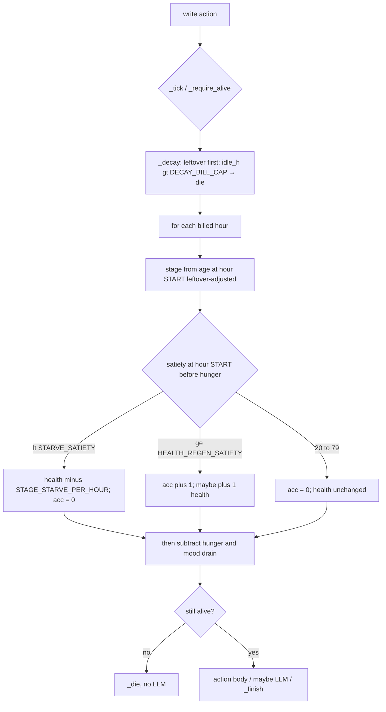

# Игровая механика AiPet — семь правок, один деплой

| Поле | Значение |
|---|---|
| Автор | Grok (design conversation) |
| Дата | 2026-08-20 |
| Статус | **Реализовано** (см. «Что реально собрано» ниже) |
| Аудитория | владелец продукта и тот, кто будет менять `contracts/ai_pet.py` |
| Контракт | `contracts/ai_pet.py` (**2288 строк** после PR 1–7 + repair; собранный `build/ai_pet.py` **39 785 байт**; на старте работы было 1380 строк / 28 979 байт) |
| Потолок Bradbury | ~52 КБ (`ROADMAP.md` §4.10, `lib/buildContract.mjs` `DEPLOY_LIMIT_BYTES = 52 * 1024`). Комментарии на деплой не уходят. |

Заголовок «один деплой» значит **один production-hatch** после PR 1–7, не девять несовместимых яиц. Промежуточный `main` помечается `DO-NOT-HATCH` (см. Rollout).

## Что реально собрано

Ветка **`gameplay-mechanics`** (от `401a79f`). PR 1–7 контрактные, затем repair-проход по результатам adversarial-ревью, затем PR 8 (копирайт фронта) и PR 9 (этот документ и README/ROADMAP).

| | |
|---|---|
| Артефакт | **39 785 байт** при гейте 40 960 (запас 1 175) и жёстком потолке 53 248 |
| Direct-тесты | **227 passed**, и на исходнике, и на `AIPET_CONTRACT=build/ai_pet.py` (было 136 на старте) |
| Смерть с хэтча | **138 billed hours** (`test_a_neglected_hatch_dies_on_billed_hour_138`), на `time_scale=3600` это **138 с ≈ 2 мин 18 с** |
| Коммиты | PR 1 `d2f899f` · PR 2 `5bd9781` · PR 3 `39cad68` · PR 4 `b825ff0` · PR 5 `55b4b1d` · PR 6 `432b896` · PR 7 `3acb23f` · repair `1a8c838` · PR 8 `1ee82a9` |

**Принятые коррекции к этому документу** (каждая утверждена владельцем и **перекрывает** текст ниже; текст ниже уже выправлен по ним):

| | Коррекция | Почему |
|---|---|---|
| C1 | `PET_MOOD_CAP = 80`, не 70 | `HATCH_MOOD` = 70, значит при капе 70 самый первый `pet()` нового питомца — механический no-op. 80 даёт новичку пять видимых нажатий и сохраняет замысел: `play()` по-прежнему единственный механический путь выше капа |
| C2 | `_decay` не читает и не пишет storage внутри почасового цикла | До `DECAY_BILL_CAP = 200` итераций × ~6 storage-операций — это и есть газовый риск, на который документ только намекал. Всё поднято в локальные `int` до цикла и записано один раз после |
| C3 | Нет `BURN`, нет перевода на нулевой адрес. Есть поле `burned_wei` | Экономически то же самое, снимает зависимость от того, примет ли GenVM перевод на `Address(bytes(20))`, работает одинаково в direct и на цепи, и закрывает демо-петлю **немедленно**, а не через ~30 минут финализации |
| C4 | Инвариантный тест на худший выживаемый простой против `DECAY_BILL_CAP` | Чтобы изменение ставок не превратило газовый кап в потолок продолжительности жизни молча |
| C5 | Таблица «цена 10 HP» в документе была неверна | См. раздел P1: реальная отдача — **≈14 HP за 0.80 GEN**, а строка «10 кормёжек за 1.00 GEN» строго доминируется и удалена |
| C6 | Пыль `0 < effective < REVIVE_COST` — застревает намеренно, и клиент обязан сказать это словами | Иначе `withdrawable_wei == "0"` рядом с ненулевым балансом читается как сломанная касса |

**Что ушло дальше документа** — восемь дыр, найденных adversarial-проходом уже после PR 7 и закрытых коммитом `1a8c838`. Каждая закрыта тестом, который падает при откате правки (проверено мутациями по одной):

1. `feed()` с нулевым value давал `+FEED_MOOD` без капа и бесплатно — восемь таких вызовов вели свежего питомца с 70 до 100, и кап `pet()` был чисто декоративным. Теперь бесплатная кормёжка — это `pet()` другим глаголом (общий `_comfort()`).
2. Хил от еды перевыстреливал на каждом вызове при полной сытости: health стоил 0.10 GEN за очко **без хода часов**. Теперь не чаще одного очка в виртуальный час (`HEALTH_FEED_HEAL_EVERY_S`).
3. `health == 0` не означало смерть: холодный чип `_apply_world` живёт вне почасового цикла, а `_decay` возвращался раньше своей проверки смерти, если не набралось целого часа. Питомец сидел на 0 HP живым и лечился двумя кормёжками за десятую часть `REVIVE_COST`.
4. Резерв на revive охранялся сырым `self.balance`, а `emit_transfer` оседает на финализации: пять подряд `withdraw` по 2 GEN из кассы в 3 GEN проходили все. Добавлен `_in_flight()` — та же арифметика вычитания, что уже была у `burned_wei`.
5. Резерв включался при `total_fed > 0`: один wei от постороннего замораживал весь суб-1-GEN баланс владельца навсегда. Теперь порог — целый `REVIVE_COST` пожизненной еды (тот же порог, что уже требовал `_till_revive_ready`).
6. Очередь приветствий нормировала слоты на очередь, а не на адрес: один враждебный сосед занимал все три и перестукивался после каждого pop. Слот теперь берёт флаг `VISIT_COOLDOWN_H`, который считался строкой выше.
7. Имя гостя — единственная чужая строка, покидающая забор `[DATA]`; 32 санитизированных символа открывали новое предложение голосом контракта. Теперь оно в кавычках и без терминаторов предложения.
8. `time_scale` обязан делить 3600 нацело, иначе арифметика остатка в `_decay` прощает до `scale-1` виртуальных секунд за действие (замерено на 3599: половина дрейфа исчезала).

---

## Overview

Семь дыр в текущей механике делают тамагочи «живым» только в промпте. Пока питомец жив, `health` только падает. `pet()` строго доминирует `play()`. Мир существует лишь в момент оплаченного `check()`. Стадии жизни — подпись под спрайтом. Черты только копятся. Гость затирает предыдущего. Корм сообщества сидит в кассе, которую владелец может вывести целиком, оставив воскрешение платным для случайного доброжелателя.

Документ предлагает **инкрементальный патч того же контракта**, без нового игрового цикла, без оракулов и без апгрейда уже задеплоенных питомцев. Каждое действие, которое говорит, по-прежнему платит за `gl.vm.run_nondet_unsafe`. `_decay` остаётся единственным писателем курсора. Компания не еда. Персона — текст владельца. Веб — только категории. Новые поля хранения = новый деплой; старые питомцы живут на старом коде; фабрика и фронт читают новые ключи защитно.

Реген, смерть и hangover **биллятся только на следующем write**, который вызывает `_decay`. Нет idle-тика. Пока никто не действует, `warp` в тестах и стена часов в жизни ничего не меняют.

Рекомендации выбраны. Open Questions — только развилки, которые документ сознательно не закрывает.

---

## Background & Motivation

AiPet — Intelligent Contract на GenLayer. Состояние лежит on-chain, строчки пишет LLM внутри транзакции, погоду и рынок контракт читает сам (`check()` → `gl.eq_principle.strict_eq` + `_read_world`). Это уже доказано на Testnet Bradbury (`ROADMAP.md` §3).

Фаза 5 роадмапа (рынок, визиты, характер, фабрика) закрыта как **фичи**. Не закрыта как **игра**. Живой прогон `npm run demo:persona` дал пять `curious` подряд — контракт это разрешает. `pet()` бесплатно поднимает настроение на +4 без цены в сытости, а `play()` просит −8 сытости за +10 настроения: рациональный игрок никогда не играет. `health` в `_nourish` / `play` / `pet` / `feed` / `visit` не растёт — шрам от десяти голодных часов лечится только смертью и 1 GEN. Стадия из `_stage(age_days)` попадает в промпт и в 16×16 спрайт и никуда больше.

Боль: игрок быстро находит доминирующую стратегию (спамить `pet()`, иногда `feed()`, никогда не `play()`, `check()` только ради фразы), а «жизнь» питомца сводится к трём полоскам, из которых одна — односторонний храповик.

Инварианты, которые этот документ **не трогает** (доказанный дизайн, не предмет спора):

1. Каждое говорящее write-действие — on-chain LLM. Нет idle-тика, нет «питомец сам смотрит погоду».
2. Non-det блоки не трогают storage. Снимок снаружи, запись детерминированно.
3. Веб грубее для `strict_eq`. Никогда живая цена.
4. `persona` — текст владельца, модель её не пишет. Дрейф — закрытый `TRAITS` + счётчики.
5. Компания не еда: `receive_visit` не ставит `last_interaction_ts` и не зовёт `_tick`.
6. Курсор распада, не «last seen»: `_decay` биллит целые виртуальные часы и хранит остаток. `_finish` курсор не трогает.
7. Текст соседа — враг: `_sanitize`, никогда в `last_quote`.
8. Потолок ~52 КБ. На старте работы дерево собиралось в 28 979 байт; после PR 1–7 + repair — **39 785 байт**. Гейт PR: артефакт < 40 КБ (запас 1 175 байт).
9. Апгрейдов нет. Новые поля = новые деплои. `get_state()` только добавляет ключи.
10. `time_scale` неизменяем после конструктора. Ставки — «за виртуальный час».
11. Визит читает `StorageType.LATEST_FINAL`. Свежий питомец недоступен ~30 мин на Bradbury.

---

## Goals & Non-Goals

**Goals**

- Сделать три метра и шесть черт *механически* различными, не только в промпте.
- Сохранить доказанные инварианты консенсуса, инъекции и экономики (курсор, компания ≠ еда, persona, coarsening).
- Уложиться в потолок деплоя; не заводить новых write-методов, если существующий может нести различие.
- Дать инженеру числа, гарды и список функций — без угадывания ставок.
- Сохранить фабрику и старых питомцев: новые ключи в `get_state()` / `get_social()` / `get_character()`, отсутствие ключа не роняет доску.

**Non-Goals**

- Off-chain бэкенд, релейер газа, оракул погоды.
- Апгрейд уже задеплоенных питомцев на Bradbury.
- Новый игровой цикл / авто-`check` / LLM в `__receive__` или `receive_visit`.
- Переписывание модели метров «как Tamagotchi 1996» (голод / счастье / дисциплина).
- Протокольная комиссия с кормёжки; публичный `withdraw`; публичный `wave()`. Сожжение GEN — **только** `REVIVE_COST` при till-revive (налог на смерть), не с еды.
- Расширение `TRAITS` или передача модели права писать `persona`.
- Историческая лента событий (её нет на узле, `ROADMAP.md` §4.4).
- Переключатель владельца «остаться мёртвым»: grief-revive уже возможен сегодня за 1 GEN снаружи; till-revive лишь меняет, *чьи* это GEN.

---

## Key Decisions

| # | Решение | Почему |
|---|---|---|
| K1 | `health` — **шрам**. Сытость часа смотрим **до** голода. Реген только пока *start-of-hour* ≥ `HEALTH_REGEN_SATIETY`. `health_regen_acc` сбрасывается, если post-check сытость `< HEALTH_REGEN_SATIETY` (середина 20–79 не копится). Полный бак 100→80 = **11 часов, +2 HP, acc 3**. 4:1 — ложь, не обещаем. 40 часов *в бэнде* — это **maintain-food 0.80 GEN** и **≈14 HP** (10 регеном + 4 доливами, коррекция C5), а не skip с полного бака. Хил от еды — не чаще очка в виртуальный час. | Полный хил с `feed()` обнуляет neglect. Вечный шрам делает `health` могильным камнем. Реген после голода выкидывает питомца из бэнда в первый же час от 80. |
| K2 | `_decay` считает **по часам**, leftover вычитается из возраста часа, `DECAY_BILL_CAP` часов за вызов; overflow = смерть (сытость/health/mood 0). | Комок врёт про голод. Closed-form по порогам — больше байт и те же off-by-one. Без капа год простоя может OOG на Bradbury и заморозить живого. 200 > всех часов до смерти из таблиц ниже. |
| K3 | `pet()` — утешение с **механическим** капом `PET_MOOD_CAP` = 80 (коррекция C1); `play()` — единственный механический путь выше. Модель по-прежнему ±3 после капа. То же касается `feed()` с нулевым value. | Не бафф `play()` и не новый метод. Кап **до** `_speak`, никогда после `_apply_reply`. |
| K4 | Мир вешается на `_decay` **без веба**. One-shot `_apply_world` на `check()` остаётся шоком. **Freezing — только one-shot; hangover = condition+market.** Каждый `_speak` (не только `check`) получает last coarsened world текстом, без фетча; старше `WORLD_STALE_H` помечается `stale`. Hangover **не** применяется к тому `check()`, который записал мир. | Авто-`check` запрещён. Stale hangover гаснет. Hangover не регенит mood (пол 0). |
| K5 | Стадии — чистая функция возраста, **без нового storage**. Зубы — таблица ставок в `_decay` и гарды `play`/`visit`. | `LIFE_STAGES` уже есть. Хранить стадию было бы дублем `_stage()`. |
| K6 | Характер — **маятник**, не наклейки: оппозиция в `_evolve`, без time-decay черт. Промпт подсказывает, контракт не фильтрует. | Time-decay на idle слишком дёргал бы характер. Фильтр «play → только playful» крутил бы лидера. |
| K7 | `visit()` остаётся owner-only. Очередь FIFO на `GREETING_QUEUE_MAX`. `receive_visit` по-прежнему без LLM. Параллельные массивы перед mutate сверяют длины. | Чужой, водящий *вашего* питомца, тратил бы сытость и голос. |
| K8 | Касса держит резерв `REVIVE_COST`, если `total_fed >= REVIVE_COST` (порог, а не «хоть один wei» — см. repair-проход). `revive(value=0)` **не переводит никуда**: поле `burned_wei += REVIVE_COST`, и вся арифметика кассы считает `effective = balance − burned_wei − in_flight` (**коррекция C3**). Параллельно — немедленный storage-кредит `till_revive_at_fed = total_fed`: вторая till-revive без **новой** еды ≥ `REVIVE_COST` ревертит сразу, в direct mode и в окне ~30 мин (`time_scale=3600` иначе зациклился бы за ~70 с). Платный `value >= REVIVE_COST` еду оставляет, **не** жжёт и **не** двигает кредит. Пыль `< REVIVE_COST` при сработавшем пороге — **намеренно застревает** (C6). | Вычитание срабатывает немедленно, а не на finalization. Кредит, не `self.balance`, закрывает демо-петлю. Stranger не кладёт GEN себе в карман. |
| K9 | Один набор правил для public и owner-only питомцев. | Две ветки `withdraw` — байты и сюрприз в UI. |
| K10 | Никаких новых write-методов. | Потолок деплоя и поверхность атаки. |

---

## Proposed Design

### Таблица констант — единственный источник чисел

Проза ниже ссылается **только** на эти имена. Старые магические литералы, которые остаются в силе, тоже названы здесь, чтобы в коде не жило два значения одного смысла.

#### Без изменения значения

| Имя | Значение | Где сейчас |
|---|---|---|
| `HISTORY_MAX` | `20` | модуль |
| `SATIETY_PER_HOUR` | `2` | модуль; после патча это ставка **adult** (и hatchling) |
| `MOOD_PER_HOUR` | `1` | модуль; базовый drain, hangover его модифицирует |
| `WEI_PER_SATIETY` | `10**16` (0.01 GEN = +1 satiety) | модуль |
| `FEED_CAP` | `50` | модуль |
| `REVIVE_COST` | `10**18` (1 GEN) | модуль |
| `VISIT_COOLDOWN_H` | `6` | модуль |
| `VISIT_MOOD_GUEST` | `3` | модуль |
| `VISIT_MOOD_HOST` | `2` | модуль |
| `VISIT_SATIETY_COST` | `3` | модуль |
| `GREETING_MAX` | `160` | модуль |
| `FOREIGN_NAME_MAX` | `32` | модуль |
| `TRAITS` | `(curious, affectionate, playful, wary, gloomy, proud)` | модуль |
| `TRAIT_MAX` | `5` | модуль |
| `TRAIT_SHOWN` | `2` | модуль |
| `EVOLVE_COOLDOWN_H` | `4` | модуль |
| `LIFE_STAGES` | `(30 elder, 7 adult, 3 kitten, 1 hatchling, 0 egg)` | модуль |
| `MARKET_MOOD` | `surging +3 … crashing −3` | модуль |
| `HATCH_SATIETY` | `70` | сейчас литерал в `__init__` |
| `HATCH_MOOD` | `70` | `__init__` |
| `HATCH_HEALTH` | `100` | `__init__` |
| `REVIVE_HEALTH` | `60` | литерал в `revive()` |
| `REVIVE_SATIETY` | `50` | `revive()` |
| `REVIVE_MOOD` | `50` | `revive()` |
| `FEED_MOOD` | `5` | литерал в `_nourish` |
| `STARVE_SATIETY` | `20` | литерал `< 20` в `_decay` |

#### Новые и изменённые

| Имя | Значение | Зачем |
|---|---|---|
| `HEALTH_REGEN_SATIETY` | `80` | порог «сыт» для регена; смотрим сытость **на старте** часа |
| `HEALTH_REGEN_HOURS` | `4` | +1 health за столько сытых биллируемых часов в бэнде |
| `HEALTH_FEED_GAIN_MIN` | `10` | минимальный satiety-gain кормёжки, которая может вылечить |
| `HEALTH_FEED_HEAL` | `1` | сколько health даёт такая кормёжка |
| `STARVE_HEALTH_PER_HOUR` | `1` | текущий безымянный `- idle_h` по health; ставка adult/egg/hatchling/kitten |
| `DECAY_BILL_CAP` | `200` | максимум часов, которые один `_decay` проигрывает поштучно; больше → смерть |
| ~~`BURN`~~ | — | **Удалена (коррекция C3).** Нулевого адреса и перевода на него нет. Вместо константы — storage-поле `burned_wei: u256`, которое растёт на `REVIVE_COST` при till-revive и вычитается из всего, что контракт сообщает о кассе |
| `PET_MOOD` | `2` | было `+4` в `pet()` |
| `PET_MOOD_CAP` | `80` | механический кап `pet()`; LLM ±3 его не слушает. **Коррекция C1**: в первой редакции стояло 70, но `HATCH_MOOD` тоже 70 — при капе 70 самое первое нажатие у нового питомца было бы механическим no-op. 80 даёт новичку ровно пять видимых нажатий (`(80−70)/PET_MOOD`) и ничего не меняет в замысле: выше капа по-прежнему только `play()`, и только за еду |
| `PLAY_MOOD` | `10` | как сейчас в `play()`, именовано |
| `PLAY_SATIETY` | `8` | как сейчас, именовано |
| `PLAY_MOOD_ELDER` | `5` | elder: половина `PLAY_MOOD` |
| `STAGE_SATIETY_PER_HOUR` | egg `1`, hatchling `SATIETY_PER_HOUR`, kitten `3`, adult `SATIETY_PER_HOUR`, elder `1` | голод по стадиям |
| `STAGE_STARVE_PER_HOUR` | egg/hatchling/kitten/adult `STARVE_HEALTH_PER_HOUR`, elder `2` | голодный урон по health |
| `STAGE_MIN_PLAY` | `"hatchling"` | `play()` при `_stage_rank >= STAGE_MIN_PLAY` |
| `STAGE_MIN_VISIT` | `"kitten"` | исходящий `visit()` при `_stage_rank >= STAGE_MIN_VISIT` |
| `WORLD_STALE_H` | `48` | hangover и «stale» в промпте живут столько виртуальных часов от `last_world_ts` |
| `WET_CONDITIONS` | `("rain", "snow", "thunderstorm", "drizzle")` | как сейчас в `_apply_world` |
| `WET_MOOD_EXTRA` | `1` | добавка к drain; **итог** мокрой погоды = `MOOD_PER_HOUR + WET_MOOD_EXTRA` = 2 |
| `CLEAR_MOOD_DRAIN` | `0` | **итог** drain при `clear` (не добавка) |
| `CRASH_MOOD_EXTRA` | `1` | добавка drain при `crashing` |
| `SURGE_MOOD_RELIEF` | `1` | снять столько drain при `surging`, пол 0 |
| `TRAIT_OPPOSITES` | `(("curious","wary"), ("playful","gloomy"), ("affectionate","proud"))` | маятник в `_evolve` |
| `GREETING_QUEUE_MAX` | `3` | FIFO неотвеченных гостей |
| `TRAIT_NUDGE` | pet `affectionate`, play `playful`, feed `proud`, visit `curious`, check `curious` | подсказка в Event-строке промпта |

`SATIETY_PER_HOUR` остаётся числом `2` и **единственным** местом, где живёт «2». Таблица стадий ссылается на него в hatchling и adult.

---

### Общий каркас `_decay` (K2)

Сегодня `_decay` (`contracts/ai_pet.py`, строки 594–631) вычитает `idle_h * SATIETY_PER_HOUR` одним комком, затем, если *итоговая* сытость `< 20`, вычитает `idle_h` из health — тоже комком. Skip 30 ч с хэтча: satiety 10, health 70, хотя первые ~25 ч питомец ещё не голодал.

P1, P3 и P4 требуют порогов внутри интервала. Рекомендация: цикл по биллируемым часам. Leftover считается **до** цикла: он нужен и курсору, и возрасту часа, и hangover.

Порядок **одного** часа: (1) стадия по возрасту часа, (2) полоса сытости на **старте** часа, (3) health/acc, (4) голод и mood. Реген и starve смотрят одну и ту же pre-hunger сытость.

```python
def _decay(self) -> int:
    cursor = int(self.last_interaction_ts)
    elapsed = self._elapsed(cursor)
    idle_h = elapsed // 3600
    leftover = elapsed - idle_h * 3600
    if idle_h == 0:
        return 0
    if idle_h > DECAY_BILL_CAP:
        # год neglect — смерть, не OOG. 200 уже больше любого death clock.
        self.satiety = u256(0)
        self.mood = u256(0)
        self.health = u256(0)
        self.health_regen_acc = u256(0)
        self.last_interaction_ts = u256(_now() - leftover // int(self.time_scale))
        self._die()
        return idle_h
    regen_acc = int(self.health_regen_acc)
    for billed in range(idle_h):
        if int(self.health) == 0:
            break
        age_days = self._age_days_at_billed_hour(idle_h, billed, leftover)
        stage = _stage(age_days)
        hunger = STAGE_SATIETY_PER_HOUR[stage]
        starve = STAGE_STARVE_PER_HOUR[stage]
        drain = self._mood_drain_per_hour(leftover, idle_h, billed)
        sat = int(self.satiety)
        if sat < STARVE_SATIETY:
            self.health = _clamp(int(self.health) - starve)
            regen_acc = 0
        elif sat >= HEALTH_REGEN_SATIETY:
            regen_acc += 1
            if regen_acc >= HEALTH_REGEN_HOURS:
                self.health = _clamp(int(self.health) + 1)
                regen_acc = 0
        else:
            regen_acc = 0          # середина 20–79: остаток не копим
        self.satiety = _clamp(sat - hunger)
        self.mood = _clamp(int(self.mood) - drain)
    self.health_regen_acc = u256(regen_acc)
    self.last_interaction_ts = u256(_now() - leftover // int(self.time_scale))
    if int(self.health) == 0:
        self._die()
    return idle_h


def _age_days_at_billed_hour(self, idle_h: int, billed: int, leftover: int) -> int:
    """Возраст в днях на СТАРТЕ часа `billed` (0-indexed). leftover — тот же, что у курсора."""
    age_s = self._elapsed(int(self.birth_ts)) - leftover - (idle_h - billed) * 3600
    return (age_s if age_s > 0 else 0) // 86400
```

Без вычитания leftover час после `revive()` в 6d 23.5h объявляется adult (7d) на час раньше: курсор revive = `_now()`, не выровнен на birth. `warp 1 ч` после действия в `7*86400 - 1800` даёт `leftover=0` и **не ловит** баг. Golden: действие/revive в `7*86400 - 1800`, warp **5400 с** (1.5 ч), затем write. Billed hour (`idle_h=1`, leftover=1800) использует kitten (`STAGE_SATIETY_PER_HOUR` 3), не adult (2). После write `_age_days()` уже может быть 7 (питомец сейчас adult), пока биллируемый час ещё был kitten.

`health_regen_acc` — новое поле `u256`, 0..`HEALTH_REGEN_HOURS-1`. Только `_decay` его пишет.

Не меняется: leftover-арифметика курсора после цикла, `_finish` курсор не трогает, `receive_visit` не вызывает `_decay`, `time_scale` только через `_elapsed`.

Измерение газа 1000 и 8760 итераций на Bradbury — **чеклист PR 1**, не блокер мержа: кап `DECAY_BILL_CAP` уходит в PR 1 сразу. Direct: `test_decay_over_DECAY_BILL_CAP_kills` (warp 201 ч → мёртв, не зависает).



Реген, смерть и hangover биллятся **на этом write**. Нет idle-тика. `warp` без последующего write состояние не меняет.

---

## P1. Health — односторонний храповик

### (a) Сейчас

Пока `alive`, health только падает.

- `_decay`: если после комка `satiety < 20`, `health -= idle_h` (строки 620–622). Почасовой ставки нет — имя `STARVE_HEALTH_PER_HOUR` вводится для текущего `1`.
- `_apply_world`: `temp == "freezing"` → `health -= 1` (строки 914–915).
- `_nourish` (общий путь `feed` и `__receive__`): поднимает satiety и mood на `FEED_MOOD`, health не трогает (664–678).
- `play` / `pet` / `visit` / `receive_visit`: health не трогают.
- Хэтч: `HATCH_HEALTH`. Revive: `REVIVE_HEALTH` / `REVIVE_SATIETY` / `REVIVE_MOOD`. Смерть при 0.

Десять голодных часов снимают 10 HP навсегда, пока кто-то не заплатит `REVIVE_COST`.

### (b) Почему это проблема игры

Игрок, который один раз опоздал на 10 ч, носит шрам до могилы. Единственный «хил» — смерть плюс 1 GEN и возврат ослабленным. Health перестаёт быть ресурсом ухода и становится таймером до платного рестарта. Метр на 96×72 (третья полоска `drawHome`, «well» в `drawStats`) врёт: его нельзя починить игрой.

### (c) Альтернативы

| | Суть | Плюс | Минус |
|---|---|---|---|
| A | Полный refill health при любом `feed()` | Просто | Neglect бесплатен задним числом |
| B | Health — вечный шрам, лечится только `revive()` | Neglect страшен | Метр мёртв как решение; рационально доводить до смерти |
| C | **Шрам с регеном в бэнде ≥ 80 (проверка до голода) и мелким хилом с сытной еды** | Neglect быстрее лечения; еда лечит, не воскрешает | Новое поле `health_regen_acc`; надо кормить, чтобы остаться в бэнде |

### (d) Рекомендация: вариант C

Реген, как и голод, биллится **на следующем write**, который зовёт `_decay`. Пока никто не действует, health стоит. UI «заживает» = «заживёт, когда кто-то сыграет, если к тому биллингу start-of-hour всё ещё ≥ 80».

1. **Idle-реген.** На старте часа, *до* вычитания hunger: если `satiety >= HEALTH_REGEN_SATIETY`, `health_regen_acc += 1`, каждые `HEALTH_REGEN_HOURS` → `health += 1`. Если post-check сытость `< HEALTH_REGEN_SATIETY` (голод **или** середина 20–79) — `health_regen_acc = 0`. Остаток через середину не переносится: иначе 3 сытых часа, просадка до 50, кормёжка до 80 даёт сюрприз +1.
2. **Хил с еды** в `_nourish`, один раз на вызов: если `gain >= HEALTH_FEED_GAIN_MIN` **и** сытость *после* начисления `>= HEALTH_REGEN_SATIETY`, то `health += HEALTH_FEED_HEAL`. Голодного куска на 0.10 GEN (gain 10, satiety 5→15) недостаточно. Сытый обед на 0.10 GEN при 75→85 даёт +1. Кормёжка на `FEED_CAP` всё равно +1, не +5.
3. Заморозка бьёт health только в `_apply_world` на `check()`, не каждый idle-час.
4. `revive()`: `REVIVE_COST`, возврат `REVIVE_HEALTH` / `REVIVE_SATIETY` / `REVIVE_MOOD`. Не через `_nourish`.
5. Потеря health быстрее восстановления — но отношение **не** 4:1 с одного бака.

**HP с одного полного бака (adult, `SATIETY_PER_HOUR`, проверка до голода):**

Часы со стартом 100, 98, …, 80 — **11 billed hours** в бэнде. Тики регена на 4-м и 8-м часе = **+2 HP**, `health_regen_acc = 3`. 12-й час стартует с 78 → acc сбрасывается. Skip 40 ч с satiety 100 **не** даёт +10 HP.

**Соотношение на 10 HP шрама (adult, без мира). Всё — billed hours следующего write, не wall-clock.**

> **Коррекция C5.** Первая редакция этой таблицы считала реген и хил от еды двумя
> отдельными покупками и просила за 10 HP еды отдельную 1.00 GEN. Так не бывает:
> запас бэнда всего 20 очков (80…100), поэтому удержать hour-start ≥ 80 сорок
> часов **невозможно без долива**. 80 satiety приходят как **четыре долива по 20**,
> и каждый долив сам по себе проходит `HEALTH_FEED_GAIN_MIN` и приземляется ≥
> `HEALTH_REGEN_SATIETY` — то есть **каждый ещё и лечит** на `HEALTH_FEED_HEAL`.
> Держать бэнд — это одновременно регенерировать и лечить, а не одно из двух.

| Направление | Что реально происходит |
|---|---|
| Потерять 10 HP голодом | 10 billed hours при start-of-hour `< STARVE_SATIETY` |
| Вернуть 10 HP idle-регеном | 10 × `HEALTH_REGEN_HOURS` = **40 billed hours в бэнде** ≥ 80 |
| Цена удержать бэнд 40 ч | 40 × `SATIETY_PER_HOUR` = 80 satiety = **0.80 GEN**, и эти 80 нельзя влить разом: запас бэнда 20 очков, значит **≥ 4 долива** |
| Что эти 0.80 GEN приносят на самом деле | 40 часов в бэнде = **+10 HP** регеном, **плюс** 4 долива × `HEALTH_FEED_HEAL` = **+4 HP** → **≈14 HP**, не 10 |
| Один skip 40 ч с бака 100 | **+2 HP**, не +10; в бэнде только 11 из 40 часов, дальше середина, acc 0 |

Строка «вернуть 10 HP едой: 10 кормёжек = 1.00 GEN / 10 txs» **удалена**: она строго
доминировалась (дороже за меньшее), а после repair-прохода ещё и невыполнима —
хил от еды нормирован одним очком на виртуальный час (`HEALTH_FEED_HEAL_EVERY_S`),
так что десять кормёжек подряд в одном блоке дают ровно **одно** очко. Раньше они
давали десять, и health стоил 0.10 GEN за очко без единого хода часов.

Elder теряет 10 HP за 5 ч (`STAGE_STARVE_PER_HOUR[elder] = 2`).

Хил от еды нормирован по времени (`HEALTH_FEED_HEAL_EVERY_S = 3600` виртуальных
секунд): не больше очка в виртуальный час, сколько бы кормёжек ни пришло. До
repair-прохода условие бэнда читало сытость **после** клампа до 100, поэтому сытый
питомец переквалифицировался на каждом вызове и health стоил 0.10 GEN за очко без
единого хода часов. Время — дефицитный ингредиент в обоих маршрутах.

Функции: `_decay`, `_nourish`, `__init__` (`health_regen_acc = 0`), `get_state()` публикует `health_regen_acc`.

### (e) Что не меняется

Курсор leftover; компания не еда; `__receive__` без LLM, хил через `_nourish` детерминирован. `FEED_CAP`, `WEI_PER_SATIETY`, `FEED_MOOD`. Freezing только на `check()`. Non-det блоки storage не пишут. Кламп 0..100.

### (f) Тесты и фронт

Сломаются (числа завязаны на комок):

- `test_starving_costs_health_but_not_life` — 30 ч: сейчас satiety 10 / health 70 (комок). После почасового walker **на adult-ставках PR 1** (проверка до голода): 26 ч до первого starve (час со стартом 20 ещё не голодает), затем 4 ч starve → satiety 10, health **96**. После P4 — satiety 34, health 100; править в PR 3.
- `test_neglect_kills_the_pet` / `LETHAL_IDLE_H = 150` — 150 всё ещё убивает (PR 1: смерть с хэтча **126 ч**; после P4: **138 ч**).
- `test_demo` — warp 150 ч ок как верх.

Новые:

- `test_no_write_after_warp_leaves_state_unchanged`
- `test_full_tank_11h_heals_plus_2_hp_acc_3` (health 90, satiety 100, warp 11 ч, один `pet()` → health 92, acc 3, satiety 78)
- `test_full_tank_40h_does_not_heal_10_hp` (тот же старт, warp 40 ч → health **92**, не 100)
- `test_sitting_at_80_first_hour_is_in_band_second_is_not`
- `test_middle_band_clears_health_regen_acc` (3 сытых часа, просадка до 50, корм до 80, 1 час → acc не даёт бонусный +1 с остатка 3)
- `test_well_fed_idle_heals_one_hp_per_HEALTH_REGEN_HOURS` (держать ≥ 80 кормами между варпами)
- `test_health_regen_remainder_survives_an_action` (3 часа на 100, write, ещё 1 час на ≥ 80 → +1)
- `test_starving_clears_health_regen_acc`
- `test_a_substantial_feed_heals_one_hp_only_when_well_fed`
- `test_a_cap_feed_still_heals_only_one_hp`
- `test_freezing_still_chips_health_on_check`
- `test_decay_over_DECAY_BILL_CAP_kills`

Фронт: «заживает, когда кто-то сыграет, если ещё ≥ 80». Старые питомцы без `health_regen_acc`: ключ опционален.

---

## P2. `pet` почти строго доминирует `play`

### (a) Сейчас

```1002:1017:contracts/ai_pet.py
    def pet(self) -> str:
        ...
        self.mood = _clamp(int(self.mood) + 4)
```

```985:1000:contracts/ai_pet.py
    def play(self) -> str:
        ...
        self.mood = _clamp(int(self.mood) + 10)
        self.satiety = _clamp(int(self.satiety) - 8)
```

Оба публичные, оба говорят, оба без кулдауна. `pet`: +4 mood, 0 satiety. `play`: +10 mood, −8 satiety (еду за настроение платит игрок).

### (b) Почему это проблема

Рациональный игрок только гладит. `play` — косметика промпта («you just had a fun play session»). Газ одинаково ненулевой, экономический смысл — только у `pet`.

### (c) Альтернативы

| | Суть | Плюс | Минус |
|---|---|---|---|
| A | Кулдаун на `pet()` | Режет спам | Новое поле ts; `play` всё ещё хуже по mood/satiety |
| B | Новый метод `train()` / мини-игра | Свежий глагол | Байт-бюджет, новый пункт меню, LLM |
| C | **Нерф `pet` + механический потолок, который берёт только `play`; bias черт в промпте** | Ноль новых методов; различие механическое | На хэтче механический `pet()` — no-op (mood уже 70) |

### (d) Рекомендация: вариант C

Порядок `pet()`: `_tick` → механический bump с капом → snapshot → `_speak` → `_apply_reply` (±3, **без** капа). Кап **до** `_speak`, никогда после `_apply_reply`: два валидатора не должны расходиться в «pet не сработал».

```python
mood = int(self.mood)
if mood < PET_MOOD_CAP:
    cap_room = PET_MOOD_CAP - mood
    bump = PET_MOOD if PET_MOOD < cap_room else cap_room
    self.mood = _clamp(mood + bump)
```

`PET_MOOD = 2`, `PET_MOOD_CAP = 80` (коррекция C1). Если mood уже 80+, механика молчит; со свежего `HATCH_MOOD = 70` первое нажатие даёт 72, а `mood_delta` +1 → **73** (`test_pet_applies_valid_reply`; в первой редакции здесь стояло 71 — это было следствие капа 70). Гладить при 90 можно: утешение и строчка, не прокачка. Бесплатная кормёжка (`feed()` с нулевым value) идёт через тот же `_comfort()` и упирается в тот же кап — иначе она строго доминировала бы `pet()`.

В `play()`: `mood += PLAY_MOOD`, `satiety -= PLAY_SATIETY`, без потолка кроме `_clamp` 100. Elder: `PLAY_MOOD_ELDER` (P4). Egg: revert (P4).

Промпт: `TRAIT_NUDGE[pet] = affectionate`, `TRAIT_NUDGE[play] = playful`.

Копирайт: **comfort, mechanical cap 70; the model may still nudge ±3**. Не писать «the only way past 70» — это ложь.

### (e) Что не меняется

Публичность обоих методов. Нет кулдауна. Satiety cost у `play`. `_speak` / `_finish`. Компания не еда. Курсор.

### (f) Тесты и фронт

Сломаются:

- `test_pet_applies_valid_reply` — сейчас 75. Станет **71** (кап держит механику на 70, +1 delta).
- `test_validator_rejects_out_of_range_delta` — сейчас 77. Станет **73**.
- `test_play_updates_state_and_speaks` — 80/62, но после P4 egg не играет.
- `test_revived_pet_acts_again` — 50 + `PLAY_MOOD` + 1 = **61**, без изменения.
- Network `play() burns satiety` — на свежем деплое egg; условный тест в PR 3.

Новые:

- `test_pet_cannot_push_mood_above_PET_MOOD_CAP` (механически; delta может)
- `test_play_can_push_mood_above_PET_MOOD_CAP`
- `test_pet_at_cap_still_speaks`

Фронт confirm: «comfort, mechanical cap 70; model may nudge ±3». Play: «play can push mood past 70, costs food». Прятать `play` у egg в PR 3.

---

## P3. Мир существует только внутри `check()`

### (a) Сейчас

Погода и рынок двигают mood **только** когда кто-то платит за `check()`:

- `check()` → `strict_eq(_read_world)` → `_apply_world` (строки 907–919): мокро `−3`, `clear +3`, `freezing` health `−1`, рынок из `MARKET_MOOD`, запись `last_market`.
- `last_market` хранится; condition и temp — нет. Следующий `pet()` мир не чувствует.
- `_decay` мира не знает. Заброшенный питомец в ливень теряет только таблицу голода.

Авто-`check` из idle запрещён: это веб + LLM на чужом газе.

Сегодня `check()` сначала `_tick`/`_decay`, потом фетч, потом `_apply_world` (926–942). Это остаётся.

### (b) Почему это проблема

«Живой мир» — одноразовый шок за газ. Между `check()` питомец в вакууме. Игрок, который не вызывает `check()`, не наказывается плохой погодой и не награждается ясной — только таблицей.

### (c) Альтернативы

| | Суть | Плюс | Минус |
|---|---|---|---|
| A | Ничего; мир = флейвор `check()` | Ноль байт | Мир не механика |
| B | Каждый speak (play/pet/feed) тоже фетчит веб | Мир частый | Двойной non-det, газ, потолок |
| C | **Persist last coarsened world, мягкий hangover в `_decay`, без веба; тот же снимок в каждый промпт** | Мир длится; `check()` остаётся единственным фетчем | Три новых поля; stale check лечится `WORLD_STALE_H` и полом 0 |

### (d) Рекомендация: вариант C

Новые поля (новый деплой): `last_condition: str`, `last_temp: str`, `last_world_ts: u256`. Инит: `""`, `""`, `0`.

`_apply_world` дополнительно:

```python
self.last_condition = str(world.get("condition", "unknown"))
self.last_temp = str(world.get("temp", "unknown"))
self.last_world_ts = u256(_now())
# last_market как сейчас
```

Пишем даже `"unknown"`: неудачный check не должен вечно держать прошлый ливень. `unknown` в hangover = нет погодного модификатора.

One-shot на `check()` **как сегодня** (мокр −3, ясно +3, freezing −1 HP, рынок из `MARKET_MOOD`). Это шок «выглянул наружу».

**Hangover никогда не применяется к тому `check()`, который записал мир.** Idle-часы *внутри этого* `check()` видят предыдущий `last_condition` (или ничего). Новый дождь даёт только one-shot и штамп `last_world_ts`. Hangover +`WET_MOOD_EXTRA`/ч начинается со **следующего** write. Не «помогать», накладывая hangover на тот же `idle_h`.

Сравнение с `last_world_ts` — по **виртуальной метке часа**, не по грубому `elapsed//3600` (тот off-by-one: 48 ч ожидания давали 47 ч hangover и вешали hangover на час *до* check, когда leftover + `idle_h == world_hours+1`).

```python
def _billed_hour_end_age_s(self, since_ts: int, leftover: int, idle_h: int, billed: int) -> int:
    """Виртуальные секунды от since_ts до КОНЦА billed-часа (формула leftover-курсора)."""
    return self._elapsed(int(since_ts)) - leftover - (idle_h - 1 - billed) * 3600

def _world_is_fresh(self, leftover: int, idle_h: int, billed: int) -> bool:
    if int(self.last_world_ts) == 0:
        return False
    end_age = self._billed_hour_end_age_s(self.last_world_ts, leftover, idle_h, billed)
    start_age = end_age - 3600
    # час НАЧАЛСЯ не раньше check и строго раньше check + WORLD_STALE_H
    return 0 <= start_age < WORLD_STALE_H * 3600

def _mood_drain_per_hour(self, leftover: int, idle_h: int, billed: int) -> int:
    drain = MOOD_PER_HOUR
    if not self._world_is_fresh(leftover, idle_h, billed):
        return drain
    cond = str(self.last_condition)
    if cond in WET_CONDITIONS:
        drain += WET_MOOD_EXTRA          # extra 1 → итог 2
    elif cond == "clear":
        drain = CLEAR_MOOD_DRAIN         # итог 0, не добавка
    # cloudy / fog / unknown: итог MOOD_PER_HOUR (1)
    market = str(self.last_market)
    if market == "crashing":
        drain += CRASH_MOOD_EXTRA        # extra 1
    elif market == "surging":
        drain -= SURGE_MOOD_RELIEF       # relief 1, пол 0
    if drain < 0:
        drain = 0
    return drain
```

Час, который **закончился** до check (`start_age < 0`), hangover не получает — даже если leftover пересёк границу. `last_world_ts == 0` → нет hangover.

Сводка **итогового** drain mood / billed hour, пока check свежий:

| condition \ market | calm/rising/unknown | surging | crashing |
|---|---|---|---|
| clear | 0 | 0 | 1 |
| cloudy / fog / unknown | 1 | 0 | 2 |
| wet | 2 | 1 | 3 |

Через `WORLD_STALE_H` — снова только `MOOD_PER_HOUR`.

`last_temp` в hangover **не** участвует. Freezing — one-shot `_apply_world`. Hangover = condition + market.

**Промпт каждого `_speak`.** `_snapshot` / `_build_prompt` получают last coarsened world **текстом, без фетча**, на `pet`/`play`/`feed`/`visit`/`revive` так же, как на `check()`. Если `last_world_ts == 0` — мира в промпте нет (как сейчас `world=None`). Если возраст ≥ `WORLD_STALE_H` — тот же JSON категорий, в `[DATA]` пометка `stale`. `check()` передаёт только что сфетченный world и `stale=False`.

`get_state()` публикует `condition`, `temp`, `last_world_ts` (int). **Не** заменять их на предвычисленный `world_age_hours`. Клиент сам считает возраст. Ключ `market` как сейчас.

### (e) Что не меняется

Веб только в `check()`, coarsening, `strict_eq`, даты рынка в прошлом, нет веба в `_decay` / `_tick` / `receive_visit`. One-shot числа `_apply_world`. `MARKET_MOOD` one-shot. Курсор.

### (f) Тесты и фронт

- `test_check_reads_weather_and_speaks` — mood **66** как сейчас (rain −3, market unknown 0, delta −1); плюс `condition == "rain"`. Hangover этого дождя на *этот* check не капает.
- `test_a_dead_market_is_reported_as_unknown_not_stale` — hangover рынка нет.

Новые:

- `test_rainy_hangover_starts_on_the_next_write_not_the_check`
- `test_hangover_after_check_warp_1h_applies`
- `test_hangover_after_check_warp_47h_applies`
- `test_hangover_after_check_warp_48h_applies` (час, стартовавший в 47 ч, ещё в окне)
- `test_hangover_after_check_warp_49h_last_hour_is_stale`
- `test_hangover_with_30min_leftover_on_check_does_not_tax_the_pre_check_hour`
- `test_last_world_ts_zero_means_no_hangover`
- `test_stale_surging_does_not_regenerate_mood`
- `test_decay_does_not_fetch_the_web` (`pet()` после `check()` — нет нового `mock_web`)
- `test_freezing_does_not_chip_health_every_idle_hour`
- `test_every_speak_prompt_contains_last_world_or_stale`

Фронт: `drawStats` `sky {condition}` если ключ есть; market на slip. Старый питомец без `condition` — как сейчас. `s.condition ?? ""`. Не прятать check.

---

## P4. Стадии жизни косметичны

### (a) Сейчас

`_stage(age_days)` — чистая функция от `LIFE_STAGES` (233–238). Попадает в `_snapshot` → промпт и в `spriteFor()`. Egg и elder имеют одинаковые ставки и доступ к `play`/`visit`. Хэтч — egg; `test_play_updates_state_and_speaks` сразу играет.

### (b) Почему это проблема

«Жизненный цикл» — спрайт и тон LLM. Меню визита прячется только для не-владельца, не для яйца.

### (c) Альтернативы

| | Суть | Плюс | Минус |
|---|---|---|---|
| A | Хранить стадию и эволюционировать её отдельным write | Явный ритуал | Новое поле, новый метод, LLM |
| B | Только копирайт / спрайт | Ноль риска | Проблема остаётся |
| C | **Модификаторы в `_decay` + гарды; стадия pure** | Без storage | Смерть с хэтча пересчитывается; network `play()` на egg ревертит |

### (d) Рекомендация: вариант C

Целые ставки, без float.

| stage | возраст | `STAGE_SATIETY_PER_HOUR` | `STAGE_STARVE_PER_HOUR` | `play` | исходящий `visit` | play mood |
|---|---|---|---|---|---|---|
| egg | 0d | `1` | `1` | нет | нет | — |
| hatchling | 1d | `SATIETY_PER_HOUR` | `1` | да | нет | `PLAY_MOOD` |
| kitten | 3d | `3` | `1` | да | да | `PLAY_MOOD` |
| adult | 7d | `SATIETY_PER_HOUR` | `1` | да | да | `PLAY_MOOD` |
| elder | 30d | `1` | `2` | да | да | `PLAY_MOOD_ELDER` |

Яйцо на желтке голодает медленнее; котёнок — ростовой голод; старик мало ест, голод бьёт health вдвое; play у старика вдвое слабее.

**Один порядок для `play` и `visit`:**

1. `_only_owner()` — только `visit`
2. валидация адреса (`visit`) — до tick, state не меняет
3. `_tick()` / `_decay`
4. если мёртв → `return str(self.last_quote)` (как сейчас `play` 987–989, `visit` 1051–1053), без LLM
5. stage guard: `_stage_rank(_stage(self._age_days())) >= _stage_rank(STAGE_MIN_*)` иначе revert
6. остальное (`play` bump, `visit` cross-contract read)

`STAGE_MIN_PLAY` используется (не `== "egg"`). Яйцо `play()`: guard после tick → revert откатывает decay, satiety остаётся `HATCH_SATIETY`. Заброшенный на 138 ч уже kitten по возрасту: `_tick` убивает, возвращает death line, **не** «too young».

```python
# play(), после _tick и still_alive
if _stage_rank(_stage(self._age_days())) < _stage_rank(STAGE_MIN_PLAY):
    raise gl.vm.UserError("too young to play — wait until you hatch")
bump = PLAY_MOOD_ELDER if _stage(self._age_days()) == "elder" else PLAY_MOOD
self.mood = _clamp(int(self.mood) + bump)
self.satiety = _clamp(int(self.satiety) - PLAY_SATIETY)

# visit(), после _only_owner, _tick и still_alive — до _neighbour_state
if _stage_rank(_stage(self._age_days())) < _stage_rank(STAGE_MIN_VISIT):
    raise gl.vm.UserError("too young to visit — wait until kitten")
```

`_stage_rank` — индекс egg→elder.

**Входящий** `receive_visit` для яйца **разрешён**. Соседи навещают яйцо; оно ответит дома. Это не кормит.

`pet` / `feed` / `check` / `revive` без возрастных гардов.

### (e) Что не меняется

`LIFE_STAGES`, `_stage` pure, нет поля `stage`. `time_scale` множит только часы. Промпт уже получает stage. Спрайты те же.

### (f) Тесты и фронт

Сломаются idle-числа на свежем деплое (egg), **после PR 3**:

- `test_play_updates_state_and_speaks` — revert или `warp_days(1)`.
- `test_acting_every_59_minutes_does_not_make_a_pet_immortal` — 11 ч egg: `70 - 11*1 = 59`.
- `test_idle_minutes_are_carried_over_not_forgiven` — полный час egg −1.
- `test_scaled_pet_drifts_in_real_seconds` — 3 ч egg: `70-3=67`.
- `test_a_scaled_pet_carries_its_remainder_too` — 5 ч egg: `70-5=65`.
- `test_starving_costs_health_but_not_life` — 30 ч: 24×1 + 6×2 = **satiety 34, health 100**.
- `test_demo` — warp до hatchling перед `play()`.
- Network: `if (stage === "egg") expect revert /too young/; else satiety down`.

Новые:

- `test_egg_refuses_play_and_visit`
- `test_play_on_egg_reverts_and_does_not_bill` (warp 10 ч, `play()` → revert, satiety 70)
- `test_lethal_idle_play_returns_death_not_too_young` (warp точный death clock, `play()` → мёртв)
- `test_hatchling_can_play_but_not_visit`
- `test_kitten_can_visit`
- `test_elder_play_mood_is_PLAY_MOOD_ELDER`
- `test_egg_can_receive_a_guest`
- `test_revive_near_7d_bills_kitten_hunger_not_adult` — revive/действие в `7*86400 - 1800`, warp **5400 с**, write: billed hour — kitten 3; `_age_days()` после write может быть уже 7
- `LETHAL_IDLE_H` точный **138** после P4; 150 — запас demo.

Фронт, в **этом же PR 3** (`menuItems` сейчас `MENU.filter(m => !m.owner || isOwner)`):

```javascript
function menuItems() {
  const stage = String(pet?.stage || "egg");
  return MENU.filter(m => {
    if (m.owner && !isOwner) return false;
    if (m.key === "play" && stage === "egg") return false;
    if (m.key === "visit" && (stage === "egg" || stage === "hatchling")) return false;
    return true;
  });
}
```

Мёртвый питомец по-прежнему только revive.

---

## P5. Черты только растут

### (a) Сейчас

`_evolve` (780–816): слово из `TRAITS` или ignore; потолок `TRAIT_MAX`; один надж за `EVOLVE_COOLDOWN_H`; только `+= 1`. Оппозиции нет. Владелец может `set_evolution` / `reset_character`. Живой demo: пять `curious` подряд (`ROADMAP.md` §3).

Валидатор проверяет, что `trait` — строка, не членство в `TRAITS`.

### (b) Почему это проблема

Характер — стопка наклеек. Нет «передумал». Монокльтура.

### (c) Альтернативы

| | Суть | Плюс | Минус |
|---|---|---|---|
| A | Time-decay черт в `_decay` | «Остывает» | Характер дёргается быстрее голода |
| B | Контракт отвергает off-action trait | Жёсткий стиринг | Лидер-ротация за gloomy в дождь |
| C | **Оппозиционные пары в `_evolve` + подсказка в промпте, без фильтра** | Анти-монокультура, closed vocabulary цел | Аккуратно эмитить `PetEvolved` |

### (d) Рекомендация: вариант C

`TRAIT_OPPOSITES` — взаимные пары. После существующих гардов (`evolving`, membership, cooldown, слот в storage). `TRAIT_MAX` — **только** на ветке increment: maxed `playful` всё ещё может сжечь `gloomy`.

```python
opp = _opposite(trait)
oi = TRAITS.index(opp)
if levels[oi] > 0:
    self.trait_levels[oi] = u256(levels[oi] - 1)
    direction = "down"
else:
    if levels[index] >= TRAIT_MAX:
        return ""
    self.trait_levels[index] = u256(levels[index] + 1)
    direction = "up"
self.last_evolved_ts = u256(_now())
self.evolutions = u256(int(self.evolutions) + 1)
PetEvolved(
    trait,                      # индексируем ЗАПРОШЕННОЕ — топик стабилен
    level=int(self.trait_levels[index]),
    lowered=opp if direction == "down" else "",
    lowered_level=int(self.trait_levels[oi]) if direction == "down" else 0,
    direction=direction,
    character=self._character(),
    evolutions=int(self.evolutions),
).emit()
```

Если opposite > 0, запрошенная черта в этом надже не растёт. Кулдаун тратится.

Промпт: `this kind of moment often makes you more {nudge} — pick that, or another of the list, or ""`. Дождь в `[DATA]`; модель может взять `gloomy`. Контракт не фильтрует. Time-decay черт нет.

**Пример** (счётчики 0, кулдаун выдержан, модель слушается nudge):

| шаг | действие | запрос | opposite | `(c,a,p,w,g,pr)` |
|---|---|---|---|---|
| 1 | `pet()` | affectionate | proud=0 | `(0,1,0,0,0,0)` |
| 2 | `play()` через 4 ч | playful | gloomy=0 | `(0,1,1,0,0,0)` |
| 3 | `check()` в дождь → `gloomy` | gloomy | playful=1 | `(0,1,0,0,0,0)` |
| 4 | ещё check-дождь | gloomy | playful=0 | `(0,1,0,0,1,0)` |

Philosopher cat из пяти `curious` возможен, пока `wary=0`.

### (e) Что не меняется

`TRAITS` закрыт. Неизвестное слово — ignore. `persona` модель не пишет. `TRAIT_MAX`, `EVOLVE_COOLDOWN_H`, `TRAIT_SHOWN`, `_character_phrase`. Owner freeze/reset. `receive_visit` не вызывает `_evolve`. Валидатор — форма, не словарь.

### (f) Тесты и фронт

Текущие тесты роста с нуля проходят. `test_a_trait_stops_at_its_ceiling` — opposite 0.

Новые: `test_raising_a_trait_decrements_its_opposite`; `test_decrementing_opposite_does_not_raise_the_requested_trait`; `test_playful_can_burn_down_deeply_gloomy_even_at_TRAIT_MAX_playful`; `test_prompt_suggests_affectionate_on_pet`; `test_off_nudge_trait_is_still_accepted`.

Фронт: пары на sheet. `get_character().opposites`. Старые питомцы без ключа — кортеж зашит во фронте.

---

## P6. Visit owner-only — переформулировка, потом дыры

### (a) Сейчас (уточнение к прошлому разговору)

`visit(other)` — «отвези **этого** питомца к `other`». Owner-only (`_only_owner`, строка 1043). Это правильно.

Чужие уже могут **привести своих** через `receive_visit`. Inbound открыт, outbound — сила владельца. Сплит верный, **оставляем**.

Реальные дыры:

1. Один pending-гость. Второй визит **затирает** `pending_from/name/quote` (1128–1130). Дружба и mood считаются.
2. Хост нем, пока владелец не заплатит за speak. LLM в `receive_visit` нельзя.
3. `_clear_greeting()` обнуляет единственный слот. `_finish(..., answered_guest=True)` чистит после домашней речи.

### (b) Почему это проблема

Два гостя за утро — первый забыт в промпте (строка в `history` через `_note` есть).

### (c) Альтернативы

| | Суть | Плюс | Минус |
|---|---|---|---|
| A | Один слот, не затирать: второй только `_note` + mood | Ноль storage-формы | Очередь длины 1 |
| B | Публичный `wave()` | Дёшевый жест | Либо молчит, либо LLM на чужом газе |
| C | **FIFO на `GREETING_QUEUE_MAX`, pop одного за speak** | До 3 голосов | Три параллельных `DynArray` |

Структуру-в-storage не вводим. `history.pop(0)` уже паттерн GenVM.

### (d) Рекомендация: вариант C

```python
pending_from: DynArray[Address]
pending_name: DynArray[str]
pending_quote: DynArray[str]
```

Sanitize **только на ingest** (`receive_visit` уже чистит имя и строку, 1120–1121). В очереди лежат уже безопасные строки. `_greeting` их не пере-sanitize.

Перед каждым mutate:

```python
def _queue_ok(self) -> bool:
    return len(self.pending_from) == len(self.pending_name) == len(self.pending_quote)
```

Если длины разъехались — не append/pop вслепую: pop только если все `len > 0`; append только если все три < `GREETING_QUEUE_MAX`. Сломанная очередь не чинится частично.

`receive_visit` после sanitize, `_count_meeting`, mood, `_note`, `PetGreeted`:

```python
if self._queue_ok() and len(self.pending_from) < GREETING_QUEUE_MAX:
    self.pending_from.append(guest)
    self.pending_name.append(name)
    self.pending_quote.append(line)
# иначе: дружба и лента уже есть; 4-й гость в history, не в промпте. Oldest не drop.
```

`_greeting()` — индекс 0 или `("", "")`.

`_clear_greeting()` — `pop(0)` с каждого, только если все `len > 0`. `_finish(answered_guest=True)` — один pop. `visit(..., answered_guest=False)` очередь дома не трогает.

`get_social()` — старые ключи = голова очереди:

```python
head = len(self.pending_from) > 0
return {
    ...
    "pending_from": self.pending_from[0].as_hex if head else "0x" + "0"*40,
    "pending_name": str(self.pending_name[0]) if head else "",
    "pending_quote": str(self.pending_quote[0]) if head else "",
    "pending": [...],
    "pending_count": len(self.pending_from),
    "greeting_queue_max": GREETING_QUEUE_MAX,
    "visit_cooldown_hours": VISIT_COOLDOWN_H,
}
```

`PetGreeted` blob: `queued`, `queue_len`. Нет `wave()`.

Если `DynArray[Address]` упадёт в direct — **тот же PR** переключается на три скалярных слота, не follow-up.

### (e) Что не меняется

`visit` owner-only. `LATEST_FINAL`. `_sanitize` на ingest. Гость никогда в `last_quote`. Нет LLM в `receive_visit`. Нет `_tick` / stamp. Кулдаун и mood/satiety визита. `on="accepted"`. Яйцо принимает гостей.

### (f) Тесты и фронт

- `test_social_view_starts_empty` — `pending: []`, `pending_count: 0`, `greeting_queue_max: 3`.
- Остальные head-тесты держатся.
- Новые: FIFO, overflow, `test_queue_pop_requires_all_three_nonempty`.
- Фронт: `social.pending ?? []`; сердце если `pending_count > 0 || pending_name`. Visit скрыт для не-владельца и egg/hatchling.

---

## P7. Публичная еда, частная касса

### (a) Сейчас

`allow_public_feed` по умолчанию `True`. Любой GEN садится на контракт (`feed` / `__receive__` / платёж `revive`). `withdraw(wei)` — owner-only, верхняя граница `self.balance`, резерва нет (1206–1225). `revive` требует `gl.message.value >= REVIVE_COST`, даже если касса полная. Network `withdraw() emits a plain value transfer` шлёт весь `held`; SETTLE ждёт `balance === 0n`.

### (b) Почему это проблема

Корм — социальный контракт «мы держим его живым». Сейчас это банкомат владельца. Revive — налог на того, кто рядом, даже если касса полная. Оставить 1 GEN на контракте навсегда и разрешить `revive(value=0)` без движения денег = **бесконечные бесплатные public revive** после первого лока. «Тратит» должно двигать GEN.

### (c) Альтернативы

| | Суть | Плюс | Минус |
|---|---|---|---|
| A | Lock forever, бесплатные revive | Просто | Смерть косметика, как только 1 GEN заперт |
| B | **Запереть `REVIVE_COST` на till-revive + немедленный кредит `till_revive_at_fed`** | Налог на смерть жив; stranger не кладёт GEN себе; демо-петля закрыта немедленно | Два новых поля (`burned_wei`, `till_revive_at_fed`); собрано вычитанием, не переводом (C3) |
| C | Transfer `REVIVE_COST` ревайверу | «Награда» | Stranger drain кассы revive-грифом — **не берём** |
| D | Комиссия / burn доли корма | «Честность» | Другой продукт |

Берём **B**. A отвергнут: смерть перестаёт быть налогом. C отвергнут явно.

Правило пустой кассы: `total_fed == 0` → резерва нет, владелец выводит пыль. Все value-пути поднимают `total_fed`.

Пыль `0 < balance < REVIVE_COST` при `total_fed > 0`: вывести нельзя, till-revive нельзя. **Намеренно застряла**, пока не придёт ещё еда. Не баг. Если `total_fed` = 0.5 GEN, till-revive невозможна (гард 3 не проходит) — тоже намеренно.

### (d) Рекомендация: вариант B (резерв + **вычитание** + кредит)

> **Коррекция C3 — читать до кода ниже.** Собрано **без** `BURN`, без
> `_Payee(BURN)` и без какого-либо перевода на нулевой адрес. Till-revive делает
> `self.burned_wei += REVIVE_COST` и не эмитит ничего; `_effective_balance()`
> считает `balance − burned_wei − in_flight` (пол 0), и **и** `_withdrawable()`,
> **и** `_till_revive_ready()` работают от этой величины там, где ниже написано
> «balance». Почему так:
>
> 1. **Экономически то же самое.** Эти GEN нельзя вывести, нельзя потратить на
>    ещё одно воскрешение и никто их не получает. Это сожжение, просто выраженное
>    вычитанием.
> 2. **Снимает риск GenVM.** Не нужно проверять, примет ли рантайм перевод на
>    `Address(bytes(20))`; исходная редакция сама оговаривала «если отвергнет —
>    фиксируем revert», то есть закладывала неизвестность в критический путь.
> 3. **Закрывает демо-петлю немедленно.** Перевод уходит только на финализации
>    (~30 мин на Bradbury) и в direct mode вообще no-op, так что до финализации
>    `self.balance` всё ещё показывал бы полную кассу. Вычитание видно в тот же
>    блок — и в direct-тестах, и на цепи.
>
> `till_revive_at_fed` остаётся: касса в 5 GEN всё равно обязана дождаться
> **новой** еды перед второй till-revive, и одного вычитания для этого мало.
> `PetRevived` по-прежнему несёт `from_till` и `burned_wei` в blob.
>
> Repair-проход добавил к этой же арифметике `_in_flight()`: `withdraw` тоже
> оседает на финализации, поэтому уже обещанные владельцу wei вычитаются ровно
> так же, иначе резерв обходится вторым нажатием кнопки внутри окна.

**Withdraw** — без изменений идеи:

```python
def _withdrawable(self) -> int:
    bal = self._effective_balance()          # balance - burned_wei - in_flight
    if int(self.total_fed) >= REVIVE_COST:   # порог, не «хоть один wei»
        if bal <= REVIVE_COST:
            return 0
        return bal - REVIVE_COST
    return bal

# после amount > 0:
if amount > int(self.balance):
    raise gl.vm.UserError("insufficient contract balance")
if amount > self._withdrawable():
    raise gl.vm.UserError("revive reserve — leave at least 1 GEN in the till")
```

**Кредит, не баланс, стопит вторую till-revive.** `EthSend` (и withdraw, и burn) не двигает `self.balance` до finalization (~30 мин на Bradbury). Direct mode — silent no-op (`tests/direct/test_ai_pet.py` 417–423). На `time_scale=3600` питомец после till-revive (satiety 50, kitten hunger 3) снова мёртв через ~70 виртуальных часов = **~70 с**, ещё внутри окна, с `balance` всё ещё ≥ `REVIVE_COST`. Без немедленного storage-кредита — бесконечные public till-revive на демо. Production `time_scale=1` за 30 мин не умирает повторно, но кредит один на всех.

Новое поле (новый деплой): `till_revive_at_fed: u256` — снимок `total_fed` в момент последней успешной till-revive (`0`, если никогда).

```python
def _till_revive_ready(self) -> bool:
    if self.alive:
        return False
    if int(self.balance) < REVIVE_COST:
        return False
    # новое кормление ≥ 1 GEN с прошлой till-revive; первый раз till_revive_at_fed==0
    return int(self.total_fed) - int(self.till_revive_at_fed) >= REVIVE_COST
```

**Revive**

```python
value = int(gl.message.value)
from_till = value == 0
if 0 < value < REVIVE_COST:
    raise gl.vm.UserError("revive costs at least 1 GEN (send it, or leave it in the till)")
if from_till:
    if not self._till_revive_ready():
        raise gl.vm.UserError("revive costs at least 1 GEN (send it, or leave it in the till)")
    # налог на смерть: GEN заперт здесь и сейчас, не ревайверу и никуда.
    self.burned_wei = u256(int(self.burned_wei) + REVIVE_COST)
    self.till_revive_at_fed = self.total_fed   # немедленно; total_fed НЕ растёт
    # _credit_feeder НЕ зовём.
else:
    # value >= REVIVE_COST: сегодняшний путь. Еда остаётся. НЕ жжём.
    # till_revive_at_fed НЕ двигаем: этот платёж — новая еда на кассе,
    # следующая смерть сможет till-revive, если total_fed вырос достаточно.
    self.total_fed = u256(int(self.total_fed) + value)
    self._credit_feeder(gl.message.sender_address, value)
```

Гарды till-revive (`value == 0`), все обязательны:

1. `not self.alive` (как сегодня «already alive»).
2. `self._effective_balance() >= REVIVE_COST` — GEN ещё на контракте и ещё не потрачен (коррекция C3: вычитаем `burned_wei` и `in_flight`, а не смотрим сырой `self.balance`).
3. `int(self.total_fed) - int(self.till_revive_at_fed) >= REVIVE_COST` — сообщество скормило ≥ 1 GEN **новой** еды с прошлой till-revive.

Дальше как сейчас: alive, weakened stats, stamp курсора, `PetRevived(..., paid_wei=str(value), from_till=from_till, burned_wei=str(REVIVE_COST if from_till else 0), revives=...)`, LLM.

Константы `BURN` нет (коррекция C3). Есть поле `burned_wei: u256`, и есть `_effective_balance()`, через который проходит каждый читатель кассы.

`self.balance` **никогда** не падает от till-revive — переводить нечего. Падает `effective`, и вместе с ним `withdrawable_wei`. Direct-тесты ассертят `burned_wei` и `withdrawable_wei`, а не `get_balance()`, и это не обход ограничения direct mode: на цепи цифры ровно те же.

Следствие кредита: касса в 5 GEN не даёт пять till-revive подряд. После первой `till_revive_at_fed = total_fed`; следующая требует ещё ≥ `REVIVE_COST` **нового** `feed`/`__receive__` (или платный revive, который как раз растит `total_fed` и кредит не трогает). Это цена немедленного стопа демо-петли.

Grief-revive: сегодня любой уже может оживить, заплатив 1 GEN. Till-revive делает *первое* воскрешение после сытой смерти расходом **сообщества**. Отдельного «остаться мёртвым» не добавляем.

Не fee с еды. `withdraw` не публичный. Смешивать `0 < value < REVIVE_COST` с кассой — нет.

`get_state()["withdrawable_wei"] = str(self._withdrawable())`.
`get_state()["till_revive_ready"] = bool(self._till_revive_ready())` — фронт пишет «the till pays» **только** когда гард прошёл бы. Старые питомцы без ключа: `?? false` → только платный revive.

K9: owner-only питомцы — то же правило.

### (e) Что не меняется

Форма `_Payee` (empty calldata). `total_fed` — lifetime. Leaderboard. `allow_public_feed` гат только корм. Мёртвому нельзя `feed`/`__receive__`. Direct не доказывает исходящий transfer.

### (f) Тесты и фронт

Сломаются:

- Network withdraw шлёт `held` → `BigInt(state.withdrawable_wei)`.
- SETTLE `balance === 0n` → **нет**. Ждать finalization, затем `withdrawable_wei === "0"`; если `total_fed > 0`, `balance >= REVIVE_COST` (остался резерв, не ноль). Не `balance === 0`.
- Фронт `doAction("revive")`: если `till_revive_ready === true`, `value = 0n` и копирайт «from the till»; иначе слать `reviveCost`. Не смотреть один `balance >= reviveCost` — сырой баланс после till-revive не падает **никогда**, он только перестаёт быть эффективным.

Новые:

- `test_owner_cannot_withdraw_the_reserve`
- `test_stranger_cannot_drain_till_by_reviving` (value=0 жжёт, не платит ревайверу; не `_credit_feeder`)
- `test_dust_below_REVIVE_COST_is_stuck_when_total_fed_positive`
- `test_half_gen_total_fed_cannot_till_revive` (`total_fed` 0.5 GEN — гард 3)
- `test_never_fed_pet_can_withdraw_dust`
- `test_revive_from_till_when_value_is_zero` (`from_till`, `burned_wei`; `total_fed` тот же; **не** `get_balance()` упал)
- `test_revive_from_till_does_not_double_count_total_fed`
- `test_till_revive_second_time_without_new_food_reverts` — снова убить без `feed`; `till_revive_ready` false; `revive(value=0)` ревертит. Ассертит **кредит** (гард 3), не падение `get_balance()`
- `test_paid_revive_does_not_also_burn` и не двигает `till_revive_at_fed`
- `test_paid_revive_counts_as_new_food_for_later_till_revive`
- `test_partial_value_does_not_mix_with_till`
- `test_withdrawable_wei_is_published`
- `test_till_revive_ready_is_published`

Network SETTLE: `get_balance()` упал на `REVIVE_COST`; вторая till-revive без новой еды ревертит и **после** finalization.

Фронт till: `withdrawable_wei ?? get_balance()`; `till_revive_ready ?? false`; `max` и **значение** поля суммы; hint «once the pet has been fed a revive's worth, 1 GEN stays back as the revive reserve; a till-revive locks it away for good, then the till needs new food». Мёртвый экран: путь из кассы только если `till_revive_ready`, иначе send 1 GEN. Кнопка Withdraw выключена, когда брать нечего.

---

## API / Interface Changes

Никаких новых write-методов. `revive` принимает `value=0` как till-burn путь.

### `get_state()` — только добавления

| Ключ | Тип | Откуда | Старые питомцы |
|---|---|---|---|
| `condition` | str | `last_condition` | нет ключа → `?? ""` |
| `temp` | str | `last_temp` | нет |
| `last_world_ts` | int | поле | нет; клиент сам считает возраст. **Нет** ключа `world_age_hours` |
| `withdrawable_wei` | str | `_withdrawable()` | нет → весь `get_balance()` |
| `till_revive_ready` | bool | `_till_revive_ready()` | нет → `?? false` (только платный revive) |
| `health_regen_acc` | int | поле | нет |

Фабрика (редизайн 2026-08-27: членство — по sha256 кода через nondet-запрос к RPC, строки борда — из её собственного хранилища через `report()`/`refresh()`, `_num`/`_clean`/`state.get` на каждом поле) новые ключи игнорирует. При выпуске новой сборки питомца добавь её отпечаток: `node tools/fingerprint.mjs build/ai_pet.py` → `add_fingerprint`.

### `get_social()`

Голова в старых ключах + `pending[]`, `pending_count`, `greeting_queue_max`. Фронт: `social.pending ?? []`.

### `get_character()`

Опционально `opposites`.

### События

| Событие | Blob | Indexed |
|---|---|---|
| `PetSpoke` | без изменения формы | `action`, `actor` |
| `PetEvolved` | `lowered`, `lowered_level`, `direction` | `trait` запрошенное |
| `PetRevived` | `from_till`, `burned_wei` | `reviver` |
| `PetGreeted` | `queued`, `queue_len` | `guest` |
| `OwnerWithdrew` | `remaining_wei` не ниже резерва | `owner` |

Топик `PetSpoke` не трогаем.

---

## Data Model Changes

Только новые деплои.

```python
health_regen_acc: u256
last_condition: str
last_temp: str
last_world_ts: u256
pending_from: DynArray[Address]
pending_name: DynArray[str]
pending_quote: DynArray[str]
till_revive_at_fed: u256          # снимок total_fed на последней till-revive; 0 = никогда
```

`burned_wei` — storage-поле, а не модульная константа: сожжённое обязано пережить транзакцию (коррекция C3).

`__init__`: acc 0, condition/temp `""`, ts 0, очереди пустые, `till_revive_at_fed = 0`.

Гейт размера: `npm run build:contract` в каждом контрактном PR, fail > 40 КБ. Замер по факту: 28 979 → **39 785 байт** за PR 1–7 + repair, то есть +10 806, а не «+2–4 КБ». Самый дорогой PR — P4 (мир и похмелье, +2 344).

---

## Cross-cutting: смерть, корм, нагрузка

Все часы ниже — **billed hours следующего write**, не wall-clock. `warp` без write ничего не делает.

### Смерть с хэтча, никто не действует (P1+P4, без мира, проверка сытости до голода)

Хэтч: satiety `HATCH_SATIETY` 70, health 100, egg. Час со стартом ровно `STARVE_SATIETY` (20) ещё не голодает.

| окно | часы жизни | hunger | сытость (конец) | health (конец) |
|---|---|---|---|---|
| egg | 1–24 | 1 | 46 | 100 |
| hatchling, ещё сыт | 25–38 (14 ч; старт 20 на 38-м) | 2 | 18 | 100 |
| hatchling, голод | 39–72 (34 ч) | 2 + hp1 | 0 | 66 |
| kitten, голод | 73–138 (66 ч) | 3 + hp1 | 0 | 0 |

**Смерть на 138-м billed hour.** Стадия kitten. Реген не включается (сытость никогда ≥ 80).

| clock | 138 виртуальных часов |
|---|---|
| `time_scale=1` | **5 суток 18 часов** |
| `time_scale=3600` | **138 с ≈ 2 мин 18 с** |

`LETHAL_IDLE_H = 150` — запас. Точный тест — 138.

PR 1 только (adult-ставки с рождения, без стадий): **1-indexed** k, час стартует с `HATCH_SATIETY - SATIETY_PER_HOUR*(k-1)`. Час со **стартом** 20 — **k=26** (`70 − 2×25 = 20`), не голодает; starve с **k=27**; 100 starve-часов → смерть на **126 ч**. (Тот же индекс, что P4-таблица: старт 20, голод со следующего часа.)

Было комком 100–150 ч. Почасовой walker чинит «все часы голодные».

### Заброшенный сытый adult / elder

Adult satiety 100: час со **стартом** 20 — **k=41** (`100 − 2×40 = 20`), starve с **k=42**; **141 billed hour** до смерти.

Elder 100, голод 1, starve 2: час со **стартом** 20 — **k=81**, starve с **k=82**; 50 starve-часов ×2 HP → **131 ч**.

### GEN, чтобы держать питомца живым одну реальную неделю

Игнор LLM-газа. `time_scale=1`, `WEI_PER_SATIETY = 10**16` (0.01 GEN за очко).
**Ставка голода зависит от стадии** (`STAGE_SATIETY_PER_HOUR`), поэтому у недели
нет одной цены — есть цена на стадию:

| стадия | голод/ч | satiety-очков за 168 ч | GEN за неделю |
|---|---|---|---|
| egg (день 0) | 1 | 168 | **1.68 GEN** |
| hatchling | 2 | 336 | **3.36 GEN** |
| kitten | 3 | 504 | **5.04 GEN** |
| adult | 2 | 336 | **3.36 GEN** |
| elder | 1 | 168 | **1.68 GEN** |

Это цена «просто жить», то есть держать `satiety ≥ STARVE_SATIETY`. Дополнительно:

| сценарий (adult) | satiety-очки | GEN |
|---|---|---|
| Старт 100, конец ≥ 20 — неделя без единой кормёжки не проходит, но так считается остаток | 256 | **2.56 GEN** |
| Держать бэнд регена ≥ 80 все 168 ч | 336, и **кормить так, чтобы hour-start ≥ 80** | **3.36 GEN**; запас бэнда 20 очков, значит ~17 доливов |

`FEED_CAP=50` → `ceil(336/50) = 7` кормёжек с пустого бака, если наливать по максимуму.

40 часов в бэнде регена: 80 satiety = **0.80 GEN** maintain-food, и это даёт
**≈14 HP** (10 регеном + 4 долива × `HEALTH_FEED_HEAL`) — см. коррекцию C5 в P1.

Нагрузка: частота speak не растёт. `_decay` ограничен `DECAY_BILL_CAP`. Очередь ≤ 3. `feeders`/`friends` неограничены — известный риск view, `ROADMAP.md` §4.3 / note у `get_top_feeders` TreeMap, не §3c.

---

## Alternatives Considered (уровень документа)

**1. Ничего не менять, задокументировать как флейвор.** Отвергнуто: три метра врут.

**2. Полный рерайт метров под Tamagotchi 1996.** Ломает ABI, тесты, спрайты, всех живых питомцев. Отвергнуто как объём.

**3. Этот пакет (рекомендация, и он же собранный).** Семь правок, почасовой `_decay`, кап итераций, till-revive через `burned_wei`, ноль новых write-методов.

**Почасовой walker vs closed-form vs батч по порогам (альтернатива K2).** Closed-form `min(hours_to_starve, hours_to_stage, hours_to_stale, hours_to_regen_tick)` экономит итерации и проигрывает в байтах плюс leftover/off-by-one (Issues 4–5 живут и там). Батч по порогам — середина, всё ещё больше кода, чем цикл. Почасовой цикл меньше, совпадает с интуицией «час за часом»; газ режет `DECAY_BILL_CAP`, а не алгебра. Closed-form в PR 1 не делаем.

---

## Security & Privacy Considerations

| Угроза | Серьёзность | Митигация |
|---|---|---|
| Промпт-инъекция гостем | Высокая | `_sanitize` на enqueue; гость не в `last_quote`; имя, вынесенное из `[DATA]`, в кавычках и без терминаторов предложения (repair) |
| Модель пишет `persona` | Высокая | Не даём |
| Hangover из живой цены | Высокая | Нет живой цены; категории + `WORLD_STALE_H` |
| Два питомца кормят друг друга | Высокая | `receive_visit` без `_tick`/stamp |
| Stale `surging` печатает mood | Средняя | Пол drain 0; 48 ч |
| Владелец грабит кассу | Средняя | Резерв (при `total_fed >= REVIVE_COST`) + `burned_wei` на till-revive + `_in_flight()` на невыстоявшиеся `withdraw` |
| Бесконечный till-revive | Высокая, если ждать только balance | `burned_wei` **немедленно** (C3) **и** кредит `till_revive_at_fed` |
| Stranger кладёт кассу себе | Высокая у варианта «transfer ревайверу» | Не берём; GEN не уходит никому, `burned_wei` растёт |
| Пыль < 1 GEN застревает | Низкая, **намеренно** (C6) | Пока не придёт ещё еда; клиент обязан объяснить это словами |
| Посторонний замораживает кассу одним wei | Средняя | Порог резерва — `total_fed >= REVIVE_COST`, а не `> 0` (repair) |
| Повторный `withdraw` внутри окна финализации | Высокая | `_in_flight()` вычитает уже обещанное (repair) |
| Питомец живёт на 0 HP | Средняя | Проверка смерти выше раннего выхода `_decay` и прямо в `_apply_world` (repair) |
| Health покупается за GEN | Средняя | Хил от еды нормирован `HEALTH_FEED_HEAL_EVERY_S` (repair) |
| Один гость занимает всю очередь | Средняя | Слот берёт флаг `VISIT_COOLDOWN_H` (repair) |
| Чужой водит питомца | Высокая | `visit` owner-only |
| Freezing idle-chip | Средняя | Только one-shot |
| Pre-check hangover | Средняя | `start_age >= 0` |
| OOG на годе neglect | Высокая без капа | `DECAY_BILL_CAP` → смерть |
| Параллельные массивы разъехались | Низкая | Сверка длин до mutate |
| Старый питомец ломает фабрику | Уже лечилось | Ключи optional |
| Старый питомец ломает новый JS | Средняя | `??` на `pending`, `withdrawable_wei`, `till_revive_ready`, `condition` |

Auth: без изменений. Persona по-прежнему on-chain.

---

## Observability

Клиент поллит (`ROADMAP.md` §4.4).

- `PetSpoke.health` иногда растёт.
- `PetEvolved.lowered` — смотреть blob, не только topic.
- `PetRevived.from_till` / `burned_wei`.
- `get_state().withdrawable_wei` / `till_revive_ready` / `condition` / `temp` / `last_world_ts` / `health_regen_acc`.
- Гейт: `npm run build:contract` каждый контрактный PR; fail > 40 КБ. Собранный артефакт после PR 1–7 + repair — **39 785 байт**, запас до гейта **1 175 байт**. Любая следующая правка контракта работает в этом запасе; PR 8 и PR 9 контракт не трогают.

---

## Rollout Plan

1. Фичафлагов on-chain нет. Каждая версия кода = новые адреса.
2. Промежуточный `main` после PR 1–6: тег **`DO-NOT-HATCH`**. Никакого Bradbury-hatch и никакого frontend-default hatch, пока PR 7 не влит **и** артефакт < 40 КБ.
3. Собрать артефакт, `AIPET_CONTRACT=build/ai_pet.py pytest tests/direct/`.
4. Затем один production-питомец на Bradbury (не `0xda5779bB…`). Старые живут на старом коде.
5. Фабрика: `register` нового. `pet_factory.py` не трогать.
6. Фронт: `s.condition ?? ""`, `s.withdrawable_wei ?? bal`, `s.till_revive_ready ?? false`, `social.pending ?? []`. PR 8 грузит живого старого питомца read-only.
7. Demo: смерть **138 с ≈ 2 мин 18 с** на `time_scale=3600` (`LETHAL_IDLE_H = 150` — запас в тестах, не часы). `time_scale` обязан делить 3600 — конструктор проверяет.
8. Rollback: не переключать дефолтный hatch, пока direct + till-burn/withdrawable путь не зелёные.

Не мигрировать состояние.

---

## Риски

| Риск | Серьёзность | Митигация |
|---|---|---|
| Почасовой `_decay` vs комковые тесты | Высокая | Переписать ожидания в тех же PR |
| Leftover в возрасте часа (7d после revive) | Высокая | Вычитать leftover; golden на warp **5400 с**, не 1 ч |
| Артефакт > потолка | Средняя | Гейт 40 КБ каждый PR |
| `DynArray[Address]` | Средняя | 3 скалярных слота в том же PR |
| Network `play()` на egg | Средняя | Условный тест; hide в PR 3 |
| SETTLE ждал `balance === 0` | Средняя | Ждать `withdrawable_wei === "0"` |
| Игрок думает, что `pet` — единственный путь выше 80 | Низкая | Копирайт про механический кап и ±3 на экране подтверждения (PR 8) |
| 4-й гость только в history | Низкая | UI queue full |
| Zero address burn отвергнут GenVM | Средняя | Проверить на Bradbury в PR 7; direct этого не увидит |
| Демо till-revive в окне finalization | Высокая без кредита | `till_revive_at_fed`; direct ассертит кредит, не balance |
| Промежуточный hatch без till/queue | Высокая | `DO-NOT-HATCH` до PR 7 |

---

## Open Questions

1. **Показывать ли `condition` на 96×72** или только на paper slip? Дефолт реализации: `sky {condition}`, market на slip. Не консенсус.
2. **`GREETING_QUEUE_MAX = 3` vs 2.** Документ берёт 3; срезать можно без ABI-лома (`greeting_queue_max` опубликован).
3. Копирайт till-revive на мёртвом экране для не-владельца (он имеет право нажать, газ его, GEN сообщества сгорят). Рекомендация: да, и только если `till_revive_ready` — «this burns 1 GEN from the till».

Не открыто: owner-only визит, компания≠еда, persona, coarsening, time_scale, `LATEST_FINAL`, no-upgrade, burn vs lock vs transfer-to-reviver.

---

## References

- `contracts/ai_pet.py` (1380 строк) — `_decay` 594–631, `_apply_world` 907–919 / freezing 914–915, `_nourish` 664–678, `play` 985–1000, `pet` 1002–1017, `visit` `_only_owner` 1043, pending overwrite 1128–1130, `withdraw` 1206–1225, `_stage` 233–238, `_evolve` 780–816, `_sanitize` 270–287, `_clear_greeting` 890–893
- `build/ai_pet.py` — 28 979 байт в текущем дереве
- `contracts/pet_factory.py` — `_verify_code` (членство по коду), `report`/`refresh` (строки борда), `get_leaderboard` (сортировка всего набора, страница после сортировки)
- `README.md`, `ROADMAP.md` §2.1–2.8, §4.3 (`get_top_feeders` / unbounded maps), §4.10 (потолок; замер 28 857), §5 Phase 5
- `tests/direct/test_ai_pet.py` — `LETHAL_IDLE_H = 150`; `test_pet` mood 75; `test_validator` 77; `test_play` 80/62; `test_starving` 10/70; `test_revived_pet_acts_again` mood 61; `test_check` 66
- `tests/direct/test_demo_playthrough.py`
- `tests/network/aiPet.test.mjs` — withdraw `held` / SETTLE `balance === 0n`; `play() burns satiety`
- `frontend/index.html` — `menuItems` 1920, сердце `pending_name` 2006, till `#ownerBox`

---

## PR Plan

Каждый PR ревьюится сам. **Production hatch только после PR 7.** Промежуточный main = `DO-NOT-HATCH`. Direct-тесты в том же PR. PR 3 прячет egg `play` во фронте в том же мерже.

---

### PR 1 — Почасовой `_decay` + шрам health (P1, K2)

- **Title:** `feat(pet): bill decay hour-by-hour and allow scarred health regen`
- **Files:** `contracts/ai_pet.py`; `tests/direct/test_ai_pet.py`; `tests/direct/test_demo_playthrough.py`
- **Depends:** нет
- **Changes:** Имена `STARVE_SATIETY`, `STARVE_HEALTH_PER_HOUR`, `HATCH_*`, `REVIVE_*`, `FEED_MOOD`, `DECAY_BILL_CAP`. Цикл по часам на **текущих** ставках 2/1 (без таблицы стадий). Сытость часа **до** hunger. `health_regen_acc`, сброс вне бэнда ≥ 80. Хил в `_nourish`. Leftover в `_age_days_at_billed_hour` уже здесь (golden на warp **5400 с** — в PR 3, когда kitten≠adult). Overflow > `DECAY_BILL_CAP` → смерть. `get_state` + `health_regen_acc`. Тесты: 30 ч → satiety 10, health **96**; full tank 11 ч → +2 HP; 40 ч → не +10; warp без write; cap 201 ч убивает. `LETHAL_IDLE_H` точный **126**, 150 запас.
- **Чеклист, не блокер:** estimate 1000 и 8760 итераций на Bradbury (кап уже в коде).
- **Не делает:** стадии, hangover, нерф pet.
- **Hatch:** нет.

Смерть с хэтча после только этого PR: **126 ч**.

---

### PR 2 — `pet` vs `play` (P2)

- **Title:** `feat(pet): cap pet() at 70 mood and nerf it to +2`
- **Files:** `contracts/ai_pet.py`; `tests/direct/test_ai_pet.py`
- **Depends:** нет (параллельно с PR 1)
- **Changes:** `PET_MOOD`, `PET_MOOD_CAP`, `PLAY_MOOD`, `PLAY_SATIETY`. Кап до `_speak`. Тесты 71 / 73.
- **Фронт копирайт:** PR 8.
- **Hatch:** нет.

---

### PR 3 — Стадии получают зубы (P4)

- **Title:** `feat(pet): stage-based hunger, starve, and action locks`
- **Files:** `contracts/ai_pet.py`; `tests/direct/test_ai_pet.py`; `tests/direct/test_demo_playthrough.py`; `frontend/index.html` (`menuItems`); `tests/network/aiPet.test.mjs`
- **Depends:** PR 1
- **Changes:** таблицы стадий, порядок `_only_owner` → `_tick` → death line → `_stage_rank >= STAGE_MIN_*`. Фронт hide play/visit **здесь**. Network: `if (stage === "egg") expect revert; else satiety down`. `LETHAL_IDLE_H` **138**. Golden leftover: `7*86400 - 1800`, warp **5400 с**. Demo: warp hatchling перед `play()`.
- **Hatch:** нет.

---

### PR 4 — Hangover мира (P3)

- **Title:** `feat(pet): persist last world and apply a stale-capped mood hangover`
- **Files:** `contracts/ai_pet.py`; `tests/direct/test_ai_pet.py`; `frontend/index.html` (`condition ?? ""`)
- **Depends:** **PR 3** (оба правят почасовой цикл; hangover на уже стадийном walker)
- **Changes:** поля мира; `_apply_world` пишет; `_mood_drain_per_hour` по `start_age`; last world в каждый `_build_prompt`; ключи `condition`/`temp`/`last_world_ts` (не `world_age_hours`). Тесты 1/47/48/49 ч, leftover 30 мин, hangover не на check, нет `mock_web` на `pet()`.
- **Hatch:** нет.

---

### PR 5 — Маятник черт (P5)

- **Title:** `feat(pet): opposing traits in _evolve and action nudges in the prompt`
- **Files:** `contracts/ai_pet.py`; `tests/direct/test_ai_pet.py`; опционально sheet
- **Depends:** лучше после PR 2
- **Changes:** `TRAIT_OPPOSITES`, blob `PetEvolved`, `nudge`.
- **Hatch:** нет.

---

### PR 6 — Очередь гостей (P6)

- **Title:** `feat(pet): FIFO greeting queue of 3, pop one per speak`
- **Files:** `contracts/ai_pet.py`; `tests/direct/test_ai_pet.py`; `frontend/index.html` (`pending ?? []`); network head-поля
- **Depends:** нет строго; не конфликтует с P4-гардом visit
- **Changes:** три `DynArray`, сверка длин, FIFO. Fallback скаляров в этом же PR.
- **Hatch:** нет.

---

### PR 7 — Резерв кассы и burn till-revive (P7)

- **Title:** `feat(pet): keep a 1 GEN revive reserve and burn it on till-revive`
- **Files:** `contracts/ai_pet.py`; `tests/direct/test_ai_pet.py`; `tests/network/aiPet.test.mjs`; `frontend/index.html` (till + dead)
- **Depends:** нет строго; **это последний контрактный PR перед hatch**
- **Changes:** `_withdrawable`, `BURN`, `_Payee(BURN).emit_transfer` на `value==0`, поле `till_revive_at_fed`, `till_revive_ready` в `get_state`. Платный путь не жжёт и не двигает кредит. Direct: reserve, dust stuck, till без `total_fed`, `till_revive_at_fed == total_fed` после успеха; вторая till-revive без новой еды ревертит **по кредиту**, не по `get_balance()`. Network SETTLE: баланс −`REVIVE_COST`; вторая till-revive без новой еды ревертит и после finalization. Фронт: `withdrawable_wei ?? balance`, `till_revive_ready ?? false`.
- **После этого PR и артефакта < 40 КБ:** снять `DO-NOT-HATCH`.

---

### PR 8 — Остаточный копирайт + QA старого питомца

- **Title:** `feat(ui): leftover copy and old-pet defensive reads`
- **Files:** `frontend/index.html` (только то, что не уехало в 3/4/6/7)
- **Depends:** PR 3, 4, 6, 7
- **Changes:** confirm-тексты P2 («mechanical cap 70; model may nudge ±3»); stats sky если ещё не в PR 4; character opposites если не в PR 5; **не** второй `menuItems`. Read-only QA на `0xda5779bB…`: страница не бросает на отсутствии `pending[]` / `withdrawable_wei` / `till_revive_ready` / `condition`.

---

### PR 9 — Документация факта

- **Title:** `docs: retarget death clock and weekly feed cost after mechanics patch`
- **Files:** `README.md`, `ROADMAP.md` §2.2 / §5
- **Depends:** PR 1 и PR 3 (126 / 138 / 3.36)
- **Changes:** таблица 138 ч / 138 с; бак регена = +2 HP не 4:1; till burn.

Каждый контрактный PR: `npm run build:contract` + direct suite на артефакте. > 40 КБ — стоп.
